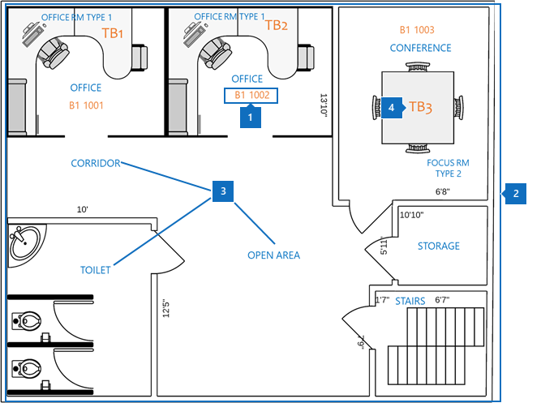
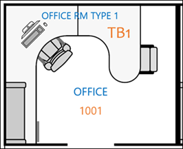

<!-- markdownlint-disable no-inline-html -->
# Microsoft 検索フロアプランのベストプラクティス

Microsoft 検索フロアプランを正常に実装するには、3つのデータを調整する必要があります。

- **場所データの作成**: 形式と追加方法を教えてください。
- **DWG 形式のフロアプランマップ**: 最大成功のために、どのようなデータを含める必要があるかを表示します。
- **Azure Active Directory 内の従業員のオフィスの場所[(azure AD)](https://azure.microsoft.com/services/active-directory/)**: 使用する形式と追加する方法  

Microsoft 検索フロアプランを展開するためのベストプラクティスについても、以下のセクションで説明します。

## 場所データの作成

フロアプランを追加する前に、Microsoft の検索場所に建物を追加する必要があります。 次の必要な建築データを提供します。

|データを作成する必要がある  |例  |
|---------|---------|
|名前     |    建物1、ニューヨーク市     |
|番地     |     123任意の方法、ニューヨーク、NY 10118  |
|緯度-経度 (省略可能)   |    40.760539、-73.975341      |
|キーワード     |    ニューヨークオフィス、建物1、本社、本社     |

一度に1つの場所を追加するのではなく、[**場所**] タブの [**インポート**] 機能を使用して、多くの建物を一度に追加することができます。 **インポート**機能を使用すると、緯度-経度を指定できます。 詳細については、「[場所を管理](manage-locations.md)する」を参照してください。

## DWG 形式のフロアプランマップ

Microsoft Search でマップを作成するには、フロアプランを DWG 形式で、特定の情報と共にアップロードする必要があります。 DWG 形式のファイルを作成して表示する方法については、「 [Dwg ビューアー](https://www.autodesk.in/products/dwg)」を参照してください。

フロアプランマップは4つの要素を表示します。

1. **部屋番号**: 次の例では、部屋番号は**B1 1001**および**b1 1002**として定義されています。 **B1**は建物コードです。 **1001**には、フロア番号**1**とオフィス番号**001**が含まれています。
1. **部屋のレイアウト**: 複数のユーザーが1つのオフィスを共有しているときに詳細をわかりやすくするために、椅子や机などのレイアウトを定義できます。
1. **部屋の種類**: 例には、office、corridor、open area、およびトイレットがあります。
1. **資産情報**: ユーザーが空き領域内にいる場合は、どの机に座っているかを示すことができます。 この例では、机は**TB1**および**TB2**によって示されています。

この図では、会議室番号は最も重要なアイテムです。 次の図に示すように、ユーザーアカウントのユーザーのオフィスの場所にマップされています。

![ユーザーの詳細情報 (office の場所を含む) を示す people 検索結果カードの [概要] タブ](media/floorplans-peoplecard.png)

この情報は、 **Physicaldeliveryofficename**プロパティの[Azure AD](https://azure.microsoft.com/services/active-directory/)に格納されています。 Microsoft 365[管理センター](https://admin.microsoft.com)では、 **Office**プロパティと呼ばれ、**アクティブなユーザー**に追加することができます。

### DWG ファイル

Microsoft Search では、DWG プランファイルが必要です。これは、 [AutoCAD](https://www.autodesk.com/autocad)図面形式です。 ファイルには、**レイアウト**と**ラベル**のデータが含まれている必要があります。 **部屋番号**は、フロアプランにとって最も重要なラベルです。

次の表に示す完全一致の方法で office の番号付けシステムを作成することをお勧めします。 しかし、そのラベル付けだけに制限はありません。 たとえば、 [AZURE AD](https://azure.microsoft.com/services/active-directory/)内のユーザーのオフィスの場所が**B1 1001**の場合、DWG ファイルの部屋番号には、次のいずれかのオプションを指定してラベルを付けることができます。

|Match  |レイアウト  |
|---------|---------|
|Office の場所を正確に一致させる (推奨)   **B1 1001**   コードを作成する: B1 床: 1  会議室番号: 001    |         |
|フロアと部屋番号を照合する   **1001** 床: 1  会議室番号: 001    |      |
|会議室番号のみを照合する   **1** 部屋番号: 1        |         |

## ユーザーアカウントのオフィスの場所

従業員の場所をマップするために、DWG ファイルの部屋番号は、 [AZURE AD](https://azure.microsoft.com/services/active-directory/)のユーザーアカウント内のオフィスの場所にマップされます。 **Office location**プロパティは、DWG ファイルのオフィスの場所情報と一致している必要があります。

次の表では、場所データのマッピングのベストプラクティスについて説明します。

|ベスト プラクティス  |説明 |
|---------|---------|
|建物のコード、フロア、および部屋番号を含めます。     |   このデータを使用すると、正確な一致を得ることができます。     |
|コードとフロアを構築した後に、区切り記号を含めます。     |  次の例に示されているように、フロア番号と部屋番号を別々に作成するコードを区切ります。  B1 1001  B1/1001   B1-1001   |
|部屋番号は、コード、翼、床面の情報の作成に常に従います。     |  部屋番号が**1001**の場合は、オフィスの場所を**b1 1001**、 **b1/1001**、または**b1-1001**に設定します。   会議室番号が**f1-001**の場合は、office の場所を**b1 F1-001**または**b1/f1-001**に設定します。   会議室番号が**1**の場合、 [Azure AD](https://azure.microsoft.com/services/active-directory/)の場所を**b1 1001**、 **b1/1001**、または**b1-F1-001**に設定します。       |
|

## 次の手順

[場所の管理](manage-locations.md) 
[フロアプランを管理する](manage-floorplans.md)
