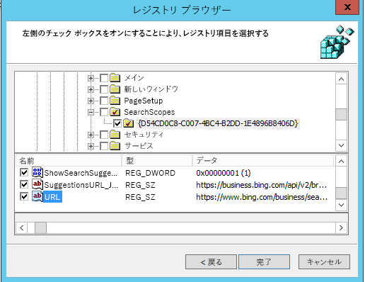

# 既定の検索エンジンの設定

既定のブラウザー、既定の検索エンジン、および既定のホーム ページを構成するがように、Microsoft 検索機能、複数の使用法をお勧めを見つけてより滑らかなエクスペリエンスを提供します。
  
組織の既定の検索エンジンを設定するのには以下の手順を実行します。
  
## Internet Explorer

### Internet Explorer 11

ユーザーはこのポリシーを設定した後検索プロバイダーを変更することになります。
  
#### 1. GPO の設定を使用するローカル コンピューターを構成します。

レジストリに次のテキストを貼り付ける (\*.reg) ファイルです。
  
Windows Registry Editor Version 5.00
  
<pre>[HKEY_CURRENT_USER\Software\Microsoft\Internet Explorer\SearchScopes]
"DefaultScope"="{D54CD0C8-C007-4BC4-B2DD-1E4896B8406D}"
[HKEY_CURRENT_USER\Software\Microsoft\Internet Explorer\SearchScopes\{D54CD0C8-C007-4BC4-B2DD-1E4896B8406D}]
"Codepage"=dword:0000fde9
"DisplayName"="Microsoft Search in Bing"
"OSDFileURL"="https://www.bing.com/sa/osd/bfb.xml"
"FaviconURL"="https://www.bing.com/sa/simg/bb.ico"
"SuggestionsURL_JSON"="https://business.ing.com/api/v2/browser/suggest?q={searchTerms}&amp;form=BFBSPA"
"ShowSearchSuggestions"=dword:00000001
"URL"="https://www.bing.com/business/search?q={searchTerms}&amp;form=BFBSPR"</pre>
  
作成されたファイルをダブルクリックし、ファイルをインポートする手順を実行します。次のダイアログ ボックスでインポートを成功させるが得られます。
  

  
#### 2. グループ ポリシー管理コンソール (gpmc.msc) を開くし、既存のポリシーを編集または新規に作成するのに切り替える

1. **ユーザー Configuration\Policies\Preferences\Windows の設定**に移動します。
    
2. **Registry\New**を右クリックし、[**レジストリ ウィザード**] を選択します。レジストリのブラウザーのウィンドウからは、**ローカル コンピューター**を選択し、[**次へ**] をクリックします。
    
3. **します Explorer\SearchScopes**に移動します。
    
4. このキーから、DefaultScope を選択してください。
    
    
  
5. Bing とすべての値を除くすべてのパスをユーザー プロファイルのキーの下で、Microsoft Search の GUID を含むすべてのサブキーを確認します。その他の項目を選択するのには下にスクロールします。
    
    
  
6. この構成を完了するには、[完了] をクリックします。
    
#### 3. DefaultScope 検索が適用されるユーザーを得る可能性があります警告を解決するユーザーの基本設定を設定します。

この警告は仕様であり、プログラムの設定を変更しようとしてのユーザーに警告します。
  
1. 同じ GPO 内では、 **Registry\New**を右クリックし、**レジストリ ウィザード**] を選択します。
    
2. **します Explorer\User の環境設定**に移動します。
    
3. **ユーザー設定**キーを選択します。
    
4. [ **完了**] をクリックします。
    
5. 新しく作成されたオブジェクトをクリックします。右側のペインで、ユーザー設定オブジェクトをダブルクリックします。**を削除**し、保存**操作**を変更します。
    
適切なドメインにリンクすることによって、結果の GPO を適用します。
  
## Microsoft Edge

### Windows 10、1703 またはそれ以降のバージョン

ユーザーはこのポリシーを設定した後検索プロバイダーを変更することになります。
  
さまざまなバージョンの Windows 用の最新の ADMX ファイルを[作成し、Windows のグループ ポリシーの管理用テンプレートの中央のストアを管理する方法](https://support.microsoft.com/en-us/help/3087759/how-to-create-and-manage-the-central-store-for-group-policy-administra)を参照してください。
  
GPMC 内でこのセクションで説明されている設定が見つからない場合は、適切な ADMX をダウンロードして、中央ストアにコピーします。詳細については、 [ADMX ファイルを使用して Gpo](https://docs.microsoft.com/en-us/previous-versions/windows/it-pro/windows-vista/cc748955%28v%3dws.10%29)を参照してください。コント ローラー上の中央のストアは、次の命名規則を含むフォルダーです。
  
 **%systemroot%\sysvol\\<domain\>\policies\PolicyDefinitions**
  
各ドメイン コント ローラーを処理する別のフォルダーが表示されます。コマンド ・ プロンプトから ADMX ファイルをコピーするのには、次のコマンドを使用できます。
  
 `Copy <path_to_ADMX.ADMX> %systemroot%\sysvol\<domain>\policies\PolicyDefinitions`
  
1. グループ ポリシー管理コンソール (gpmc.msc) を開き、既存のポリシーを編集または新規に作成するのに切り替えます。
    
2. 移動**&lt;コンピューターとユーザーの構成&gt;\Administrative Templates\Windows Components\Microsoft エッジ**。
    
1. **既定の検索エンジンの設定**をダブルクリックして、 **[有効**] に設定を入力してください。`https://www.bing.com/sa/osd/bfb.xml`
    
3. 適切なドメインにリンクすることによって、結果の GPO を適用します。
    
## Google Chrome

### Windows XP SP2 またはそれ以降

ユーザーはこのポリシーを設定した後検索プロバイダーを変更することはできません。
  
クロムは、 [Google Chrome のエンタープライズのヘルプ](https://support.google.com/chrome/a/answer/187202)から ADMX ファイルの形式でダウンロードできるグループ ポリシー設定の独自のセットが付属しています。オペレーティング システム Windows Vista の場合/2008 またはそれ以降のサーバーがドメインの GPO を管理するために使用されると、クロムの設定で Windows XP SP2 またはそれ以降の処理、ADMX ファイルがこのパッケージで提供されています。
  
テンプレート ファイルをドメイン コント ローラーの ADMX ファイルの中央ストアにコピーします。詳細については、 [ADMX ファイルを使用して Gpo](https://docs.microsoft.com/en-us/previous-versions/windows/it-pro/windows-vista/cc748955%28v%3dws.10%29)を参照してください。コント ローラー上の中央のストアは、次の命名規則を含むフォルダーです。
  
 **%systemroot%\sysvol\\<domain\>\policies\PolicyDefinitions**
  
各ドメイン コント ローラーを処理する別のフォルダーが表示されます。コマンド ・ プロンプトから ADMX ファイルをコピーするのには、次のコマンドを使用できます。
  
 `Copy <path_to_Chrome.ADMX> %systemroot%\sysvol\<domain>\policies\PolicyDefinitions`
  
1. グループ ポリシー管理コンソール (gpmc.msc) を開き、任意の既存のポリシーを編集または新規に作成するのに切り替えます。
    
2. 両方のユーザーまたはコンピューターの構成の管理用テンプレート] セクションで次のフォルダーが表示されるかどうかを確認: Google Chrome と Google Chrome を既定の設定です。
    
  - 最初のセクションの設定が固定されており、ローカルの管理者は、ブラウザーでは変更できません。
    
  - 後者のポリシーのセクションの設定は、ブラウザーの設定でユーザーが変更できます。
    
3. **に移動\<コンピューター/ユーザー\> Templates\Google Chrome\Default の構成管理用テンプレートの検索プロバイダー**
    
4. 、**既定の検索プロバイダーを有効にする**] をダブルクリックし、それが**有効**に設定します。
    
5. **既定の検索プロバイダーのアイコン**をダブルクリックして、 **[有効**] に設定し、入力`https://www.bing.com/sa/simg/bb.ico`
    
6. **インスタントの検索プロバイダーの URL を既定値**をダブルクリックし、入力`https://www.bing.com/business/search?q={searchTerms}&amp;form=BFBSPR`
    
7. **既定の検索プロバイダーの名前**をダブルクリックして、それが有効に設定および 'Microsoft は Bing の検索' を入力してください。
    
8. **既定の検索プロバイダーの検索の URL**をダブルクリックして、 **[有効**] に設定を入力してください。`https://www.bing.com/business/search?q={searchTerms}&amp;form=BFBSPR`
    
9. **既定の検索プロバイダーの URL を提案する**をダブルクリックし、 **[有効**] に設定し、入力`https://business.bing.com/api/v2/browser/suggest?q={searchTerms}&amp;form=BFBSPA`
    
10. 適切なドメインにリンクすることによって、結果の GPO を適用します。
    
既定の検索エンジンを設定すると、ブラウザーのアドレス バーに Microsoft Search の検索候補機能が追加されます。現在、これだけのブックマークをサポートします。アドレス バーに入力するときは、パブリック web 提案上トップの 2 つのブックマーク候補が表示されます。